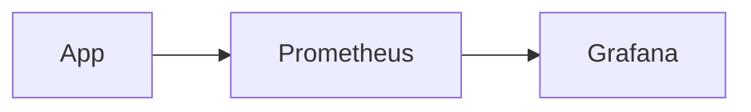

# 📊 Presentaciones Educativas Slidev

Sistema reutilizable de presentaciones educativas profesionales con **Slidev** + **Vue 3** + **Markdown**.

## Características

- **Sin servidor** — solo necesitas Node.js para editar; el resultado final es un PDF/PPT
- **Exportación múltiple** — PDF, PowerPoint (PPTX), PNG, Markdown
- **Dark mode / Light mode** — configurable por presentación
- **Mermaid** — diagramas de arquitectura, flujos, secuencias
- **Componentes Vue** — terminal, código, preguntas, comparaciones
- **Identidad corporativa** — portada y cierre con imágenes propias
- **Localización** — español de España (es-ES) y valenciano

## Requisitos

- [Node.js](https://nodejs.org/) 20+ (v24 recomendado)
- npm (viene con Node)

## Inicio rápido

```bash
# 1. Clonar el repo
git clone https://github.com/TU_USUARIO/presentaciones-educativas.git
cd presentaciones-educativas

# 2. Instalar dependencias (solo la primera vez)
npm install

# 3. Previsualizar en el navegador
npm run dev
```

Se abre `http://localhost:3030` con la presentación.

## Estructura del proyecto

```
presentaciones-educativas/
├── public/
│   ├── inicio.png              # Fondo de portada (solo 1.ª diapositiva)
│   └── final.png               # Fondo de cierre (solo última diapositiva)
├── components/                 # Componentes Vue reutilizables
│   ├── Terminal.vue            # Simulador de terminal
│   ├── CodeCard.vue            # Bloque de código con título
│   ├── Question.vue            # Pregunta interactiva
│   ├── Answer.vue              # Respuesta oculta (v-click)
│   ├── Warning.vue             # Avisos (warning/danger/info/tip)
│   ├── Comparison.vue          # Comparación correcto/incorrecto
│   ├── StepProcess.vue         # Proceso numerado
│   └── TechCard.vue            # Tarjeta de tecnología
├── styles/
│   ├── variables.css           # Tokens de diseño (colores, espaciado)
│   ├── typography.css          # Tipografía Inter + JetBrains Mono
│   ├── components.css          # Estilos de componentes
│   └── layout.css              # Layouts de diapositiva
├── openspec/                   # Especificaciones del proyecto
├── slides.md                   # ← TU PRESENTACIÓN (editar este archivo)
├── slides-template.md          # Plantilla para nuevas presentaciones
├── package.json
└── README.md
```

## Crear una nueva presentación

### Opción 1: Copiar la plantilla

```bash
cp slides-template.md slides.md
```

Edita `slides.md` con tu contenido.

### Opción 2: Crear desde cero

Copia `slides.md` a `slides-nombre.md` y edita:

```yaml
---
theme: default
title: "Tu título"
exportFilename: "tu-archivo"
layout: cover
background: /inicio.png
colorSchema: light
---
```

## Diapositivas: sintaxis rápida

### Separar diapositivas

```markdown
---
```

### Layouts disponibles

| Layout | Uso |
|--------|-----|
| `cover` | Portada con fondo inicio.png |
| `end` | Cierre con fondo final.png |
| `center` | Contenido centrado |
| `two-cols` | Dos columnas |
| `section` | Separador de sección |

### Animaciones

```markdown
<v-clicks>

- Elemento 1
- Elemento 2
- Elemento 3

</v-clicks>
```

### Código

````markdown
```python
def hola():
    print("Hola mundo")
```
````

### Código resaltado

````markdown
```yaml highlight=2-3
services:
  prometheus:
    image: prom/prometheus
```
````

### Diagrama Mermaid

````markdown

````

### Componentes Vue

```markdown
<Terminal title="Instalar" :lines="[{prompt:true, text:'npm install'}]" />

<CodeCard title="config.yml" lang="yaml">
key: value
</CodeCard>

<Question question="¿Cuál es la respuesta?">
<Answer>42</Answer>
</Question>
```

## Exportar

### Exportar a PDF

```bash
npx slidev export
```

Se genera `observabilidad-prometheus-grafana.pdf` en la raíz.

### Exportar a PowerPoint

```bash
npx slidev export --format pptx
```

### Exportar a PNG (imágenes)

```bash
npx slidev export --format png
```

### Exportar solo páginas específicas

```bash
npx slidev export --range 1-5,10
```

### Exportar en modo oscuro

```bash
npx slidev export --dark
```

### Nombre personalizado

```bash
npx slidev export --output mi-presentacion.pdf
```

### conversion a ODP (LibreOffice)

```bash
# Exportar a PDF primero, luego convertir con LibreOffice
npx slidev export --output presentacion.pdf
libreoffice --convert-to odp presentacion.pdf
```

## Imágenes corporativas

| Archivo | Uso |
|---------|-----|
| `public/inicio.png` | SOLO fondo de la **primera** diapositiva |
| `public/final.png` | SOLO fondo de la **última** diapositiva |

**No usar** estas imágenes en diapositivas intermedias.

## Directorio de contenido

Las diapositivas intermedias usan el sistema visual propio (fondo blanco/oscuro según `colorSchema`).

## Colores del tema

### Light mode (por defecto)

| Elemento | Color |
|----------|-------|
| Fondo | `#FFFFFF` |
| Texto principal | `#0F172A` |
| Accent | `#3B82F6` (azul) |

### Dark mode

```yaml
colorSchema: dark
```

## Personalización

### Cambiar color accent

Edita `styles/variables.css`:

```css
--accent-blue: #3B82F6;  /* ← cambiar este valor */
```

### Cambiar tipografía

Edita `styles/typography.css` y `styles/variables.css`:

```css
--font-sans: 'TuFuente', sans-serif;
```

## Comandos

| Comando | Descripción |
|---------|-------------|
| `npm run dev` | Previsualizar en navegador |
| `npm run build` | Build de producción |
| `npm run export` | Exportar a PDF |

## OpenSpec

Gestión de especificaciones:

```bash
/opsx-explore    # Explorar una idea
/opsx-propose    # Proponer un cambio
/opsx-apply      # Implementar cambio
/opsx-sync       # Sincronizar specs
/opsx-archive    # Archivar cambio completado
```

## Solución de problemas

### El PDF no incluye animaciones

Las animaciones `v-click` se exportan mostrando todo el contenido. Es comportamiento normal.

### Mermaid no renderiza

Comprueba que la sintaxis del diagrama es correcta en [mermaid.live](https://mermaid.live).

### Las imágenes no aparecen

Verifica que están en `public/` y que la ruta en el frontmatter es `/inicio.png` (con `/` al inicio).

## Licencia

[CC BY-SA 4.0](https://creativecommons.org/licenses/by-sa/4./) — Creative Commons Attribution-ShareAlike
