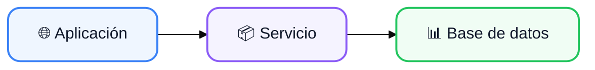

# Título de la presentación

## Subtítulo

<br>

**Módulo:** Nombre del módulo  
**Curso:** 1.º ASIR / DAM

---

# ¿Qué veremos hoy?

<br>

<v-clicks>

<div class="features-grid">
<div class="feature-item">
<div class="feature-icon">🔍</div>
<div><strong>Tema 1</strong></div>
</div>

<div class="feature-item">
<div class="feature-icon">📊</div>
<div><strong>Tema 2</strong></div>
</div>

<div class="feature-item">
<div class="feature-icon">📈</div>
<div><strong>Tema 3</strong></div>
</div>

<div class="feature-item">
<div class="feature-icon">🐳</div>
<div><strong>Tema 4</strong></div>
</div>
</div>

</v-clicks>

---

# Sección 1

## Concepto principal

<br>

<v-clicks>

- Punto importante 1
- Punto importante 2
- Punto importante 3

</v-clicks>

---

# Diagrama



---

# Código

<CodeCard title="ejemplo.py" lang="python">

```python
def saludar(nombre):
    """Función de ejemplo"""
    print(f"Hola, {nombre}")

saludar("Mundo")
```

</CodeCard>

---

# Terminal

<Terminal title="Ejecutar comando" :lines="[{prompt:true, text:'python ejemplo.py'}, {text:'Hola, Mundo'}]" />

---

# Actividad

<Question question="¿Cuál es el resultado del código anterior?">

<v-click>

<Answer title="Respuesta">
Se imprime `Hola, Mundo` en la terminal.
</Answer>

</v-click>

</Question>

---

# Resumen

<br>

<div class="features-grid">
<div class="feature-item">
<div class="feature-icon">✅</div>
<div><strong>Tema 1</strong></div>
<div style="color:#94a3b8;font-size:0.8rem">Completado</div>
</div>

<div class="feature-item">
<div class="feature-icon">✅</div>
<div><strong>Tema 2</strong></div>
<div style="color:#94a3b8;font-size:0.8rem">Completado</div>
</div>

<div class="feature-item">
<div class="feature-icon">✅</div>
<div><strong>Tema 3</strong></div>
<div style="color:#94a3b8;font-size:0.8rem">Completado</div>
</div>
</div>

---
layout: end
background: /final.png
---
