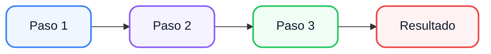

<style>
@import url('./styles/variables.css');
@import url('./styles/typography.css');
@import url('./styles/components.css');
@import url('./styles/layout.css');

.mermaid {
  font-family: 'Inter', sans-serif !important;
}
</style>

# Título de la presentación

## Subtítulo

<br>

**Módulo:** Nombre del módulo  
**Curso:** 1.º ASIR / DAM

---

# ¿Qué veremos hoy?

<br>

<v-clicks>

- **Tema 1** — Conceptos fundamentales
- **Tema 2** — Instalación y configuración
- **Tema 3** — Primeros pasos prácticos
- **Tema 4** — Actividades y ejercicios

</v-clicks>

---

# Sección 1: Concepto

## Definición y contexto

<br>

<v-clicks>

- Punto importante 1 con explicación detallada
- Punto importante 2 con ejemplo práctico
- Punto importante 3 con analogía

</v-clicks>

---

# Sección 1: Detalle

## Tabla comparativa

| Concepto | Definición | Ejemplo |
|----------|-----------|---------|
| **A** | Descripción de A | Ejemplo de A |
| **B** | Descripción de B | Ejemplo de B |
| **C** | Descripción de C | Ejemplo de C |

<br>

<v-click>

> 💡 **Tip:** Los conceptos se entienden mejor con comparaciones.

</v-click>

---

# Sección 1: Diagrama



---

# Sección 1: Código

```python
def ejemplo(parametro):
    """Función de ejemplo con explicación"""
    resultado = parametro * 2
    return resultado

# Uso
print(ejemplo(5))  # Salida: 10
```

<br>

<v-click>

- `def` — declara la función
- `parametro` — dato de entrada
- `return` — dato de salida

</v-click>

---

# Sección 1: Terminal

```bash
$ python ejemplo.py
Salida: 10
$ echo "Operación completada"
Operación completada
```

---

# Sección 1: Mini-comprobación

<v-clicks>

1. **Pregunta 1:** ¿Cuál es el resultado del código anterior?
2. **Pregunta 2:** ¿Para qué sirve `return`?
3. **Pregunta 3:** ¿Qué pasaría sin el `return`?

</v-clicks>

<br>

<v-click>

**Respuestas:**

- 1. Se imprime `10`
- 2. Devuelve el valor calculado
- 3. La función devuelve `None`

</v-click>

---

# Sección 1: Resumen

<v-clicks>

- ✅ Concepto A entendido
- ✅ Concepto B con tabla comparativa
- ✅ Diagrama de flujo visualizado
- ✅ Código practicado en terminal

</v-clicks>

---

# Sección 2: Instalación

## Requisitos previos

<br>

<v-clicks>

1. **Paso 1:** Descargar el software desde la web oficial
2. **Paso 2:** Ejecutar el instalador con valores por defecto
3. **Paso 3:** Verificar la instalación en terminal

</v-clicks>

---

# Sección 2: Verificación

```bash
$ herramienta --version
herramienta v2.1.0
$ echo "¡Instalación correcta!"
¡Instalación correcta!
```

<br>

<v-click>

> ⚠️ Si el comando no se reconoce, revisa la variable de entorno PATH.

</v-click>

---

# Sección 2: Troubleshooting

| Error típico | Causa | Solución |
|--------------|-------|----------|
| **Comando no encontrado** | PATH no configurado | Añadir `bin/` al PATH |
| **Versión incorrecta** | Múltiples versiones instaladas | Usar `which` para localizar |
| **Permisos denegados** | Falta sudo en Linux/macOS | Ejecutar con `sudo` |

---

# Sección 2: Resumen

- ✅ Software instalado correctamente
- ✅ Verificación en terminal superada
- ✅ Errores comunes identificados

---

# Sección 3: Primeros pasos

## Estructura básica

```java
public class Ejemplo {
    public static void main(String[] args) {
        System.out.println("¡Hola desde Java!");
    }
}
```

---

# Sección 3: Explicación línea a línea

| Línea | Función |
|-------|---------|
| `public class Ejemplo` | Declara una clase pública |
| `public static void main` | Punto de entrada del programa |
| `System.out.println(...)` | Imprime texto por consola |
| `}` | Cierra el bloque |

---

# Sección 3: Ejercicio práctico

## Tu turno

<br>

<v-clicks>

1. Crea un archivo `Saludo.java`
2. Escribe el código del ejemplo anterior
3. Compila: `javac Saludo.java`
4. Ejecuta: `java Saludo`
5. Comprueba que aparece el mensaje

</v-clicks>

---

# Sección 3: Variaciones

```java
// Variante 1: Múltiples println
System.out.println("Línea 1");
System.out.println("Línea 2");

// Variante 2: print sin salto
System.out.print("Línea 1");
System.out.print("Línea 2");
// Resultado: Línea 1Línea 2
```

---

# Sección 3: Errores comunes

| Error | Mensaje | Causa |
|-------|---------|-------|
| Falta `{` | `reached end of file` | No se cerró la clase |
| Falta `;` | `';' expected` | No terminó la instrucción |
| `string` minúscula | `cannot find symbol` | Debe ser `String` |

---

# Sección 4: Actividades

## Ejercicio integrador

<br>

<v-clicks>

1. **Crea** un programa que imprima tu nombre y edad
2. **Usa** al menos 3 `System.out.println`
3. **Compila** y ejecuta sin errores
4. **Depura** si algo falla (usa breakpoints)

</v-clicks>

---

# Sección 4: Solución esperada

```java
public class MiDatos {
    public static void main(String[] args) {
        System.out.println("Nombre: Ana García");
        System.out.println("Edad: 20 años");
        System.out.println("Ciclo: DAM");
    }
}
```

---

# Preguntas frecuentes

<v-clicks>

- **¿Puedo usar un bloc de notas?** Sí, pero un IDE es más rápido
- **¿Qué pasa si cambio el nombre de main?** Java no lo encuentra
- **¿Sirve para hacer páginas web?** No directamente, pero sí para servidores

</v-clicks>

---

# Recursos adicionales

<v-clicks>

- 📖 [Documentación oficial de Java](https://docs.oracle.com/en/java/)
- 🎥 [Video tutorial: Primeros pasos](https://example.com)
- 💻 [Ejercicios online](https://example.com/exercises)
- 📝 [Cheatsheet de comandos](https://example.com/cheatsheet)

</v-clicks>

---
layout: end
background: /final.png
---
