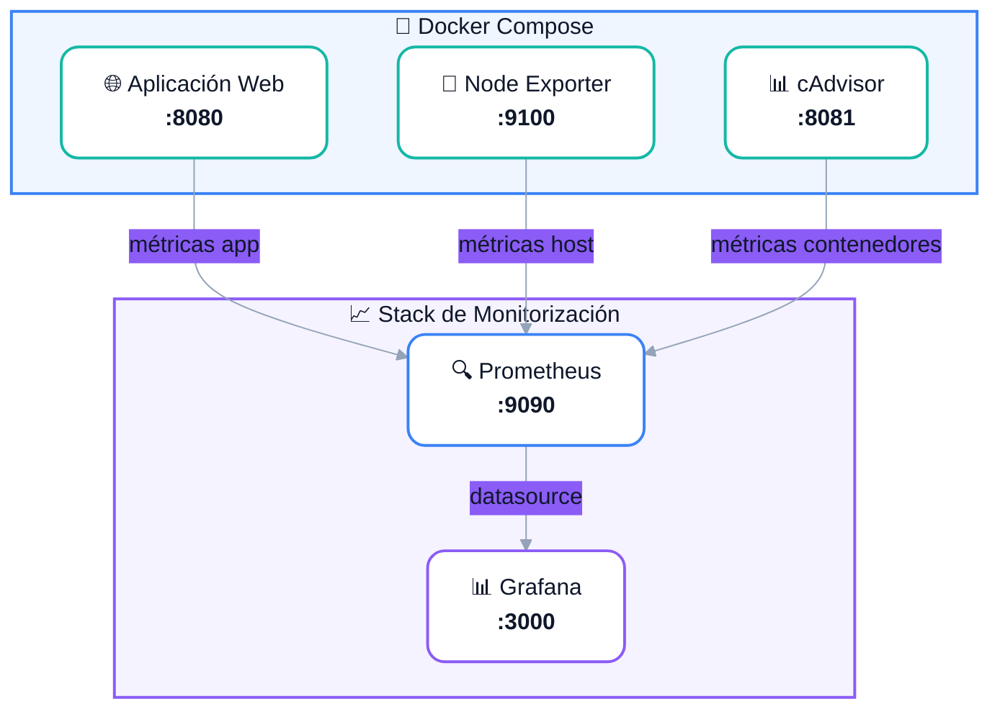
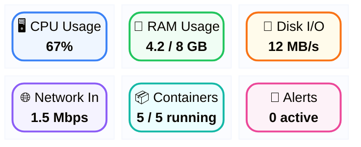

<style>
@import url('./styles/variables.css');
@import url('./styles/typography.css');
@import url('./styles/components.css');
@import url('./styles/layout.css');

.mermaid {
  font-family: 'Inter', sans-serif !important;
}
.mermaid .node rect,
.mermaid .node polygon,
.mermaid .node circle {
  rx: 12 !important;
  ry: 12 !important;
  stroke-width: 2px !important;
}
.mermaid .edgePath .path {
  stroke-width: 2px !important;
}
.mermaid .cluster rect {
  rx: 16 !important;
  ry: 16 !important;
}
</style>

# Observabilidad y Monitorización

## Prometheus + Grafana en entornos de laboratorio

<br>

**Módulo:** Administración de Sistemas Operativos  
**Curso:** 1.º ASIR / DAM

---
layout: center
class: text-center
---

# ¿Qué veremos hoy?

<br>

<v-clicks>

<div class="features-grid">
<div class="feature-item">
<div class="feature-icon">🔍</div>
<div><strong>Observabilidad</strong></div>
<div style="color:#94a3b8;font-size:0.8rem">Métricas, logs, trazas</div>
</div>

<div class="feature-item">
<div class="feature-icon">📊</div>
<div><strong>Prometheus</strong></div>
<div style="color:#94a3b8;font-size:0.8rem">Recopilación de métricas</div>
</div>

<div class="feature-item">
<div class="feature-icon">📈</div>
<div><strong>Grafana</strong></div>
<div style="color:#94a3b8;font-size:0.8rem">Visualización y dashboards</div>
</div>

<div class="feature-item">
<div class="feature-icon">🐳</div>
<div><strong>Docker</strong></div>
<div style="color:#94a3b8;font-size:0.8rem">Contenedores en laboratorio</div>
</div>
</div>

</v-clicks>

---

# El problema

## ¿Por qué necesitamos monitorizar?

<br>

<v-clicks>

- ¿Cómo sabemos si un servidor está **funcionando correctamente**?

- ¿Cómo detectamos que un servicio se está **quedando sin recursos**?

- ¿Cómo **diagosticamos** un problema antes de que nos llamen los usuarios?

</v-clicks>

<br>

<v-click>

<div class="warning">
Sin monitorización, solo sabemos que algo va mal cuando <strong>ya ha fallado</strong>.
</div>

</v-click>

---

# Observabilidad

## Los tres pilares

<br>

<div class="features-grid">
<div class="feature-item" style="border-top:3px solid #06b6d4">
<div class="feature-icon">📊</div>
<div><strong>Métricas</strong></div>
<div style="color:#94a3b8;font-size:0.85rem;margin-top:0.5rem">
Números medidos en el tiempo<br>
<code>CPU, RAM, peticiones/s, latencia</code>
</div>
</div>

<div class="feature-item" style="border-top:3px solid #10b981">
<div class="feature-icon">📝</div>
<div><strong>Logs</strong></div>
<div style="color:#94a3b8;font-size:0.85rem;margin-top:0.5rem">
Registros de eventos<br>
<code>errores, accesos, transacciones</code>
</div>
</div>

<div class="feature-item" style="border-top:3px solid #8b5cf6">
<div class="feature-icon">🔗</div>
<div><strong>Trazas</strong></div>
<div style="color:#94a3b8;font-size:0.85rem;margin-top:0.5rem">
Seguimiento de peticiones<br>
<code>latencia por servicio, cascada</code>
</div>
</div>
</div>

---

# Arquitectura del laboratorio

## Visión general del sistema

<br>



---

# Docker Compose

## Definición de servicios

<br>

<CodeCard title="docker-compose.yml" lang="yaml">

```yaml
services:
  prometheus:
    image: prom/prometheus:latest
    ports:
      - "9090:9090"
    volumes:
      - ./prometheus.yml:/etc/prometheus/prometheus.yml
    networks:
      - monitoring

  grafana:
    image: grafana/grafana:latest
    ports:
      - "3000:3000"
    environment:
      GF_SECURITY_ADMIN_PASSWORD: admin
    networks:
      - monitoring

  node-exporter:
    image: prom/node-exporter:latest
    ports:
      - "9100:9100"
    networks:
      - monitoring

networks:
  monitoring:
    driver: bridge
```

</CodeCard>

---

# Prometheus

## ¿Qué es y cómo funciona?

<br>

<v-clicks>

<div class="step">
<div class="step-number">1</div>
<div class="step-content">
<strong>Scrape</strong> — Prometheus <em>recoge</em> métricas de los exporters cada N segundos
</div>
</div>

<div class="step">
<div class="step-number">2</div>
<div class="step-content">
<strong>Almacena</strong> — Las guarda en una base de datos temporal optimizada (TSDB)
</div>
</div>

<div class="step">
<div class="step-number">3</div>
<div class="step-content">
<strong>Consulta</strong> — PromQL permite consultar métricas de forma flexible
</div>
</div>

<div class="step">
<div class="step-number">4</div>
<div class="step-content">
<strong>Alerta</strong> — Reglas de alerta notifican cuando algo no va bien
</div>
</div>

</v-clicks>

---

# Exporters

## Recopiladores de métricas

<br>

| Exporter | Métricas | Puerto |
|----------|----------|--------|
| **Node Exporter** | CPU, RAM, disco, red del host | `:9100` |
| **cAdvisor** | Uso de recursos de contenedores | `:8081` |
| **App exporter** | Métricas específicas de la aplicación | `:8080` |

<br>

<v-click>

<div class="info">
Cada exporter expone un endpoint <code>/metrics</code> que Prometheus consulta periódicamente.
</div>

</v-click>

---

# Configuración de Prometheus

## Scrape targets

<br>

<CodeCard title="prometheus.yml" lang="yaml">

```yaml
global:
  scrape_interval: 15s
  evaluation_interval: 15s

scrape_configs:
  - job_name: "prometheus"
    static_configs:
      - targets: ["localhost:9090"]

  - job_name: "node-exporter"
    static_configs:
      - targets: ["node-exporter:9100"]

  - job_name: "cadvisor"
    static_configs:
      - targets: ["cadvisor:8081"]
```

</CodeCard>

---

# PromQL

## Consultas de métricas

<br>

### Nivel básico

```
# Uso de CPU en porcentaje
100 - (avg(rate(node_cpu_seconds_total{mode="idle"}[5m])) * 100)
```

<br>

<v-click>

### Con filtros

```
# Memoria libre en un host específico
node_memory_MemAvailable_bytes{instance="node-exporter:9100"}
```

</v-click>

<v-click>

### Agregación

```
# Top 5 de contenedores por uso de CPU
topk(5, rate(container_cpu_usage_seconds_total[5m]))
```

</v-click>

---

# Grafana

## Visualización de datos

<br>

<v-clicks>

<div class="step">
<div class="step-number">1</div>
<div class="step-content">
<strong>Datasource</strong> — Conectar Grafana con Prometheus (<code>http://prometheus:9090</code>)
</div>
</div>

<div class="step">
<div class="step-number">2</div>
<div class="step-content">
<strong>Dashboard</strong> — Crear paneles con consultas PromQL
</div>
</div>

<div class="step">
<div class="step-number">3</div>
<div class="step-content">
<strong>Visualizar</strong> — Gráficas de líneas, barras, gauges, tablas
</div>
</div>

<div class="step">
<div class="step-number">4</div>
<div class="step-content">
<strong>Alertas</strong> — Configurar notificaciones en Grafana
</div>
</div>

</v-clicks>

---

# Dashboard típico

## Panel de monitorización

<br>



---

# Puesta en marcha

## Paso a paso

<br>

<CodeCard title="Terminal" lang="bash">

```bash
# 1. Clonar o crear la estructura
mkdir monitoring-lab && cd monitoring-lab

# 2. Crear docker-compose.yml y prometheus.yml
# (como hemos visto en las diapositivas anteriores)

# 3. Levantar los servicios
docker compose up -d

# 4. Comprobar que funcionan
docker compose ps

# 5. Abrir Prometheus
start http://localhost:9090

# 6. Abrir Grafana
start http://localhost:3000
```

</CodeCard>

---

# Actividad

## Interpretación de métricas

<br>

<Question question="Si el uso de CPU está al 95% durante 10 minutos y la memoria está al 40%, ¿qué problema podríamos estar teniendo?">

<v-click>

<Answer title="Posible causa">
Un proceso está consumiendo excesiva CPU pero no memoria. Podría ser un <strong>bucle infinita</strong>, un <strong>proceso zombie</strong>, o una <strong>carga de trabajo intensiva en cómputo</strong>. La memoria descarta fugas de datos. Habría que identificar el proceso con <code>top</code> o <code>htop</code>.
</Answer>

</v-click>

</Question>

---

# Actividad 2

## Diagnóstico con PromQL

<br>

<Question question="Escribe una consulta PromQL que muestre los 3 contenedores que más memoria están utilizando.">

<v-click>

<Answer title="Solución">
```solución
topk(3, container_memory_usage_bytes{name=~".+"})
```
La función <code>topk</code> ordena de mayor a menor. El filtro <code>name=~".+"</code> excluye contenedores sin nombre.
</Answer>

</v-click>

</Question>

---

# Buenas prácticas

## Recomendaciones para el laboratorio

<br>

<v-clicks>

<div class="step">
<div class="step-number">1</div>
<div class="step-content">
<strong>Scrape interval</strong> — No bajar de 10s. Para laboratorio, 15s es suficiente.
</div>
</div>

<div class="step">
<div class="step-number">2</div>
<div class="step-content">
<strong>Retención</strong> — Configurar retención de datos (por defecto 15 días).
</div>
</div>

<div class="step">
<div class="step-number">3</div>
<div class="step-content">
<strong>Labels</strong> — Usar labels para filtrar: <code>job</code>, <code>instance</code>, <code>env</code>.
</div>
</div>

<div class="step">
<div class="step-number">4</div>
<div class="step-content">
<strong>Alertas</strong> — Empezar con alertas críticas: host caído, disco lleno, servicios down.
</div>
</div>

<div class="step">
<div class="step-number">5</div>
<div class="step-content">
<strong>Dashboards</strong> — Exportar/importar dashboards de Grafana.com para ahorrar tiempo.
</div>
</div>

</v-clicks>

---

# Error frecuente

## Errores comunes en monitorización

<br>

<Comparison title="Errores típicos">

<template #good>
<div>

✅ **Scrape interval adecuado**  
Prometheus consulta cada 15s  
Los datos son representativos

✅ **Labels consistentes**  
Mismos nombres en todos los servicios  
Filtros funcionan correctamente

</div>
</template>

<template #bad>
<div>

❌ **Intervalo demasiado bajo**  
Scrape cada 1s en producción  
Sobrecarga Prometheus y los targets

❌ **Labels inconsistentes**  
<code>job="app"</code> vs <code>app="service"</code>  
Los dashboards no muestran datos

</div>
</template>

</Comparison>

---

# Reto

## Pongamos en práctica

<br>

<v-clicks>

<div class="step">
<div class="step-number">1</div>
<div class="step-content">
<strong>Monta</strong> el stack de monitorización con Docker Compose
</div>
</div>

<div class="step">
<div class="step-number">2</div>
<div class="step-content">
<strong>Añade</strong> un servicio web simple (nginx o Python)
</div>
</div>

<div class="step">
<div class="step-number">3</div>
<div class="step-content">
<strong>Crea</strong> un dashboard en Grafana con CPU, RAM y tráfico de red
</div>
</div>

<div class="step">
<div class="step-number">4</div>
<div class="step-content">
<strong>Genera</strong> tráfico artificial y observa cómo cambian las métricas
</div>
</div>

<div class="step">
<div class="step-number">5</div>
<div class="step-content">
<strong>Documenta</strong> las consultas PromQL que hayas utilizado
</div>
</div>

</v-clicks>

---

# Resumen

## Lo que hemos visto

<br>

<div class="features-grid">
<div class="feature-item">
<div class="feature-icon">🔍</div>
<div><strong>Observabilidad</strong></div>
<div style="color:#94a3b8;font-size:0.8rem">Métricas + Logs + Trazas</div>
</div>

<div class="feature-item">
<div class="feature-icon">📦</div>
<div><strong>Exporters</strong></div>
<div style="color:#94a3b8;font-size:0.8rem">Node Exporter, cAdvisor</div>
</div>

<div class="feature-item">
<div class="feature-icon">🔍</div>
<div><strong>Prometheus</strong></div>
<div style="color:#94a3b8;font-size:0.8rem">Scrape, TSDB, PromQL</div>
</div>

<div class="feature-item">
<div class="feature-icon">📈</div>
<div><strong>Grafana</strong></div>
<div style="color:#94a3b8;font-size:0.8rem">Dashboards, visualización</div>
</div>
</div>

<br>

<v-click>

<div class="success">
La monitorización no es un lujo: es una <strong>necesidad</strong> en cualquier entorno de producción.
</div>

</v-click>

---
layout: center
class: text-center
---

# Fuentes

<br>

- [Prometheus Documentation](https://prometheus.io/docs/)
- [Grafana Documentation](https://grafana.com/docs/)
- [Node Exporter](https://github.com/prometheus/node_exporter)
- [cAdvisor](https://github.com/google/cadvisor)
- [Docker Compose](https://docs.docker.com/compose/)

---
layout: end
background: /final.png
---
